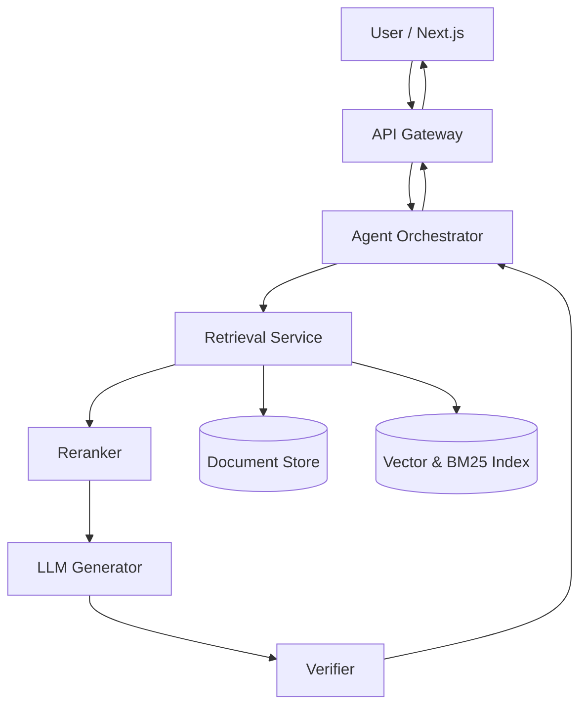

# System Architecture Diagram (Mermaid)

```mermaid
flowchart TD
    U[User / Next.js] --> A[API Gateway]
    A --> O[Agent Orchestrator]
    O --> R[Retrieval Service]
    R --> RR[Reranker]
    RR --> G[LLM Generator]
    G --> V[Verifier]
    V --> O
    O --> A
    A --> U

    R --> D[(Document Store)]
    R --> I[(Vector & BM25 Index)]
```
---